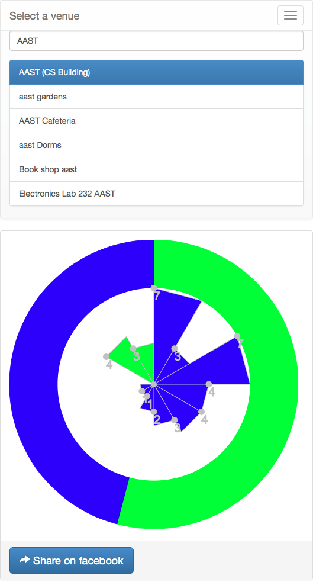

#	Introduction:
----

	Generates Timepiece graphs based on foursquare checkins and shares it on facebook!.. just thought, I should try AngularJS :D!

	

----
#	Implementation:
----

----
+	AngularJS App:
	+	Services:
		+	dataLoader
	+	Controllers:
		+	menuCtrl
		+	progressCtrl
		+	canvasCtrl
---
+	AppEngine Servlet:
	+ [facebook.java](): 	facebook graph API & OAuth 2.0 clients
	+ [foursquare.java](): 	foursquare API & OAuth 2.0 clients
----

----
##	dataLoader:
---

+	Functions:
	+	[**getCheckins(offset)**](): Uses Foursquare Checkins API to retrieve user's checkin history starting from a given offset and recursing till the end, filling the **venues** and **venueIds**
		+	Triggers **'progress'** event per request
	+	[**getVenues()**](): returns the **venues**
	+	[**getVenueIds()**](): returns the **venueIds**

----
## menuCtrl:
----

+	Variables:
	+	**selected**: the selected venue from the menu
	+	**searchQuery**: the string value of the search textfield
	+	**venues**: instance of **dataLoader.getVenues()**
	+	**venueIds**: instance of **dataLoader.getVenueIds()**
	+	**searchResults**: array of venues to be displayed in the menu list
+	Functions:
	+	**select(venue)**: set the **selected** variable as instance of the selected menu item
	+	**search()**: filters the **venues** based on the **searchQuery**
	+	**isSelected(venue)**: returns true if the **selected** venue matches the given parameter

----
## progressCtrl:
----

+	Variables:
	+	**progress**: 	percentage to be displayed in the Bootstrap's progress bar; updates on **'progress'** event

----
## canvasCtrl:
----

+	Functions:
	+	**drawTimepiece(venue)**: draws the AM/PM Timepiece graphs for a given venue in the **canvas**
	+	**drawChart(venue)**: 	draws a pie-chart comparing the maximum user's checkins and the number of checkins for the given venue in the **canvas**
	+	**shareFB()**: 	triggered on button click, directs to **share.html** which will converts the Canvas into data blob and post it to facebook (needs SessionStorage)
+	Event handlers:
	+	**'drawCanvas'**: calls **drawChart** and **drawTimepiece**